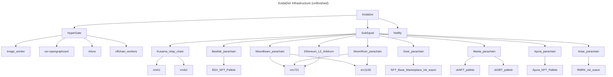

# KodaDot's Repository Statistics

## KodaDot Infrastructure

## Pace of development

##  / Recent activity 

##  / Top contributors

RepoTracker
---

[Peak on recent activity over KodaDot](https://repo-tracker.com/r/gh/kodadot/nft-gallery)

Axiom - Repobeats
---

Crowd.dev - AnalyzeMyRepo
---

[Verbose version from AnalyzeMyRepo](https://analyzemyrepo.com/analyze/kodadot/nft-gallery)

We're constantly growing
---

Repotrends - new issues and pull requests
--
- [repotrends.com/kodadot/nft-gallery](https://www.repotrends.com/kodadot/nft-gallery)

Recent Contributors ✨
---

Check out KodaDot's [monthly statistics](https://github.com/kodadot/nft-gallery/pulse/monthly) and each contributors [activity]((https://github.com/kodadot/nft-gallery/graphs/contributors))

Star history ⭐️
---

Brief code structure
---

[Interactive visualization](https://octo-repo-visualization.vercel.app/?repo=kodadot%2Fnft-gallery)

<!-- ### Is it maintained? -- I guess if it's not under 10d not worth showing off

 -->

Open Bounties sorted by bounty size
---

