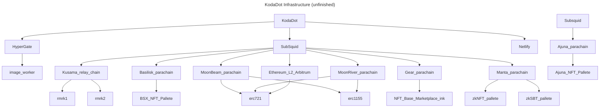

# KodaDot's Repository Statistics

## KodaDot Infrastructure

## Pace of development

##  / Recent activity 

##  / Top contributors

### RepoTracker

[Peak on recent activity over KodaDot](https://repo-tracker.com/r/gh/kodadot/nft-gallery)

## We're constantly growing!

## Recent Contributors ✨

Check out KodaDot's [monthly statistics](https://github.com/kodadot/nft-gallery/pulse/monthly) and each contributors [activity]((https://github.com/kodadot/nft-gallery/graphs/contributors))

## Brief code structure

[Interactive visualization](https://octo-repo-visualization.vercel.app/?repo=kodadot%2Fnft-gallery)

<!-- ### Is it maintained? -- I guess if it's not under 10d not worth showing off

 -->

## Open Bounties sorted by bounty size

## Star history 

### New Issues and pull requests 
- https://www.repotrends.com/kodadot/nft-gallery

