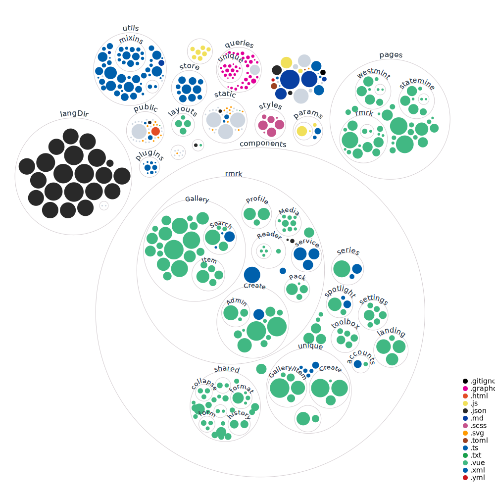

# NFT Explorer for Kusama & Polkadot ecosystem

## Coordination
[](https://discord.gg/35hzy2dXXh)

[](https://discord.gg/35hzy2dXXh)

## Repository Statistics

<!-- ALL-CONTRIBUTORS-BADGE:START - Do not remove or modify this section -->
[](#contributors-)
[](https://deepscan.io/dashboard#view=project&tid=13903&pid=16948&bid=372223)

[](https://deepsource.io/gh/kodadot/nft-gallery/?ref=repository-badge)
<!-- ALL-CONTRIBUTORS-BADGE:END -->


[](https://GitHub.com/kodadot/nft-gallery/watchers/)
[](https://GitHub.com/kodadot/nft-gallery/stargazers/)
[](https://GitHub.com/kodadot/nft-gallery/network/)

[](https://GitHub.com/kodadot/nft-gallery/graphs/contributors/)
[](https://GitHub.com/kodadot/nft-gallery/network/)

<!-- [](https://github.com/Naereen/StrapDown.js/issues?q=is%3Aopen) I don't like orange -->
[](https://GitHub.com/kodadot/nft-gallery/issues/)
[](https://github.com/Naereen/StrapDown.js/issues?q=is%3Aclosed)

[](https://GitHub.com/kodadot/nft-gallery/pull/)
[](https://github.com/kodadot/nft-gallery/pulls?q=is%3Aopen)

[](https://github.com/kodadot/nft-gallery/pulls?q=is%3Aclosed)
[](https://github.com/kodadot/nft-gallery/pulls?q=is%3Amerged)


[](https://github.com/kodadot/nft-gallery/blob/master/LICENSE)

[](https://open.vscode.dev/kodadot/nft-gallery)
[](https://www.apiseven.com/en/contributor-graph?chart=contributorOverTime&repo=kodadot/nft-gallery)



### Is it maintained?
[](http://isitmaintained.com/project/kodadot/nft-gallery "Average time to resolve an issue")
[](http://isitmaintained.com/project/kodadot/nft-gallery "Percentage of issues still open")

## 🧫 Culture - where you can read our recent updates
* [Twitter](https://twitter.com/KodaDot)
* [Discord](https://discord.gg/u6ymnbz4PR)

### Discontinued for now (if you want help us manage these, shout out on Discord)
* [Telegram](https://t.me/kodadot)
* [r/KodaDot](https://www.reddit.com/r/KodaDot/)

## 📚 Writings by KodaDot team members
* [KodaDot 2.0 -- Beta](https://medium.com/kodadot/kodadot-2-0-beta-d136f6ff139)
* [We've organized first Dotsama meetup in Lisbon thanks to KodaDot](https://medium.com/kodadot/first-dotsama-meetup-in-lisbon-and-how-the-kodadot-team-helped-to-make-it-real-10b4ca63d0b5)
* [Mass Airdrop and what we've learned](https://medium.com/kodadot/mass-airdrop-and-what-weve-learned-d063efb7c088)
* [Introducing Series Insights](https://medium.com/kodadot/introducing-series-insights-dde52dbadf5d)
* [JPEG summer is over. It's over, right?](https://medium.com/kodadot/jpeg-summer-is-over-its-over-right-e893ca2eeaa9)
* [Hello Kusummer](https://medium.com/kodadot/hello-kusummer-kodadot-edition-faca87753418)
* [Client-first NFT gallery: Technical examination](https://medium.com/kodadot/client-first-nft-gallery-technical-examination-33db09dfdc97)
* [How to Embed your NFT on Kusama through KodaDot](https://medium.com/kodadot/how-to-embed-your-nft-on-kusama-through-kodadot-ee52c2384b0d)
* [Traverse to the prime show](https://medium.com/kodadot/traverse-to-the-prime-show-733d6046d3f5)
* [The First Multilingual NFT Gallery in Polkadot ecosystem running live on Kusama](https://medium.com/kodadot/the-first-multilingual-nft-gallery-in-polkadot-ecosystem-running-live-on-kusama-b8f7566770be)
* [Read our story, how we started.](https://medium.com/kodadot/kodadot-nft-explorer-f2c3a326a856)


## Working version ▶️

* [Explore and Mint NFTs](https://nft.kodadot.xyz/)

## Roadmap 🛣 🗺

- [Beta](https://github.com/orgs/kodadot/projects/1)
- [XR - KodaVerse](https://github.com/orgs/kodadot/projects/2/views/1)
- [Meta Mobile](https://github.com/orgs/kodadot/projects/3/views/1)

## Development 🏗

[Contribution is welcome!](CONTRIBUTING.md) and well rewarded in $KSM!

We are using `yarn` workspace, as installing things via npm **will result in broken dependencies.**

## Contributors ✨

Thanks goes to these wonderful people ([emoji key](https://allcontributors.org/docs/en/emoji-key)):

<a href="https://github.com/kodadot/nft-gallery/graphs/contributors">
<!-- ALL-CONTRIBUTORS-LIST:START - Do not remove or modify this section -->
<!-- prettier-ignore-start -->
<!-- markdownlint-disable -->
<table>
  <tr>
    <td align="center"><a href="https://twitter.com/yangwao"><br /><sub><b>Matej Nemček</b></sub></a><br /><a href="https://github.com/kodadot/nft-gallery/commits?author=yangwao" title="Code">💻</a></td>
    <td align="center"><a href="https://github.com/vikiival"><br /><sub><b>Viki Val</b></sub></a><br /><a href="#research-vikiival" title="Research">🔬</a></td>
    <td align="center"><a href="https://github.com/JKrupinski"><br /><sub><b>Jarek Krupiński</b></sub></a><br /><a href="https://github.com/kodadot/nft-gallery/commits?author=JKrupinski" title="Code">💻</a></td>
    <td align="center"><a href="https://github.com/coreman000"><br /><sub><b>Mikhail Krasnoselskii</b></sub></a><br /><a href="#translation-coreman000" title="Translation">🌍</a></td>
    <td align="center"><a href="https://github.com/jimmy-tudeski"><br /><sub><b>jimmy-tudeski</b></sub></a><br /><a href="#translation-jimmy-tudeski" title="Translation">🌍</a></td>
    <td align="center"><a href="https://github.com/harrymoneyy"><br /><sub><b>Harry</b></sub></a><br /><a href="#translation-harrymoneyy" title="Translation">🌍</a></td>
    <td align="center"><a href="https://github.com/Curu24"><br /><sub><b>Jiri Rozinek</b></sub></a><br /><a href="#translation-Curu24" title="Translation">🌍</a></td>
  </tr>
  <tr>
    <td align="center"><a href="https://github.com/Summer2040"><br /><sub><b>Summer2040</b></sub></a><br /><a href="#translation-Summer2040" title="Translation">🌍</a></td>
    <td align="center"><a href="https://github.com/achrafchi"><br /><sub><b>achrafchi</b></sub></a><br /><a href="#translation-achrafchi" title="Translation">🌍</a></td>
    <td align="center"><a href="https://github.com/lunacek"><br /><sub><b>lunacek</b></sub></a><br /><a href="#translation-lunacek" title="Translation">🌍</a></td>
    <td align="center"><a href="https://github.com/razi429"><br /><sub><b>razi429</b></sub></a><br /><a href="#translation-razi429" title="Translation">🌍</a></td>
    <td align="center"><a href="https://snyk.io/"><br /><sub><b>Snyk bot</b></sub></a><br /><a href="#security-snyk-bot" title="Security">🛡️</a></td>
    <td align="center"><a href="https://github.com/joaopscastro"><br /><sub><b>joaopscastro</b></sub></a><br /><a href="#translation-joaopscastro" title="Translation">🌍</a></td>
    <td align="center"><a href="https://github.com/anindyabaidya"><br /><sub><b>anindyabaidya</b></sub></a><br /><a href="#translation-anindyabaidya" title="Translation">🌍</a></td>
  </tr>
  <tr>
    <td align="center"><a href="https://iamonuwa.dev/"><br /><sub><b>Onuwa Nnachi Isaac</b></sub></a><br /><a href="https://github.com/kodadot/nft-gallery/commits?author=iamonuwa" title="Code">💻</a></td>
    <td align="center"><a href="https://github.com/ferhatsirin77"><br /><sub><b>Ferhat Sirin</b></sub></a><br /><a href="#translation-ferhatsirin77" title="Translation">🌍</a></td>
    <td align="center"><a href="https://github.com/hernanvqt"><br /><sub><b>hernanvqt</b></sub></a><br /><a href="#translation-hernanvqt" title="Translation">🌍</a></td>
    <td align="center"><a href="https://github.com/unknow112"><br /><sub><b>Martin Tonhauzer</b></sub></a><br /><a href="#translation-unknow112" title="Translation">🌍</a></td>
    <td align="center"><a href="https://github.com/katongo11"><br /><sub><b>katongo11</b></sub></a><br /><a href="#translation-katongo11" title="Translation">🌍</a></td>
    <td align="center"><a href="https://github.com/kzyxyz"><br /><sub><b>kzyxyz</b></sub></a><br /><a href="#translation-kzyxyz" title="Translation">🌍</a></td>
    <td align="center"><a href="https://github.com/yacare555"><br /><sub><b>yacare555</b></sub></a><br /><a href="https://github.com/kodadot/nft-gallery/commits?author=yacare555" title="Code">💻</a></td>
  </tr>
  <tr>
    <td align="center"><a href="https://github.com/Ryan-Gordon"><br /><sub><b>Ryan Gordon</b></sub></a><br /><a href="https://github.com/kodadot/nft-gallery/commits?author=Ryan-Gordon" title="Code">💻</a></td>
    <td align="center"><a href="https://github.com/avcdsld"><br /><sub><b>Takamasa Arakawa</b></sub></a><br /><a href="https://github.com/kodadot/nft-gallery/commits?author=avcdsld" title="Code">💻</a></td>
    <td align="center"><a href="https://github.com/apps/dependabot"><br /><sub><b>dependabot[bot]</b></sub></a><br /><a href="#security-dependabot[bot]" title="Security">🛡️</a></td>
    <td align="center"><a href="https://github.com/apps/allcontributors"><br /><sub><b>allcontributors[bot]</b></sub></a><br /><a href="#talk-allcontributors[bot]" title="Talks">📢</a></td>
  </tr>
</table>

<!-- markdownlint-restore -->
<!-- prettier-ignore-end -->

<!-- ALL-CONTRIBUTORS-LIST:END -->
  
</a>

Made with [contributors-img](https://contrib.rocks).

## 🕹 Play

```shell
git clone git@github.com:kodadot/nft-gallery.git
yarn
yarn dev
open http://localhost:9090/
```

## 🙋‍♀️ I want to contribute

Sure, your **contribution** is welcome. Please follow [code of conduct](CODE_OF_CONDUCT.md) and [contribution guidelines](CONTRIBUTING.md)

## Support the project ⭐
If you feel awesome and want to support us in a small way, please consider starring and sharing the repo! This helps us getting known and grow the community. 🙏

## Patronage 💸
We have list of frequent participants in our codebase.
**You can send them $KSM**, native currency we use to payout bounties for Pull Requests and coordinating issues.

### Heroes 🦸‍♂️🦸🦸‍♀️
- [RoiLeo](https://kodadot.xyz/transfer/?target=DVYy1qnocE8t6ZvUfPx3rEjG829khNRXx3YrCGVHHj19Lcb)
- [Yangwao](https://kodadot.xyz/transfer/?target=CuHWHNcBt3ASMVSJmcJyiBWGxxiWLyjYoYbGjfhL4ovoeSd)
- [Vikiival](https://kodadot.xyz/transfer/?target=Fksmad33PFxhrQXNYPPJozgWrv82zuFLvXK7Rh8m1xQhe98)
- [Prachi00](https://kodadot.xyz/transfer/?target=EzGc4s9PgCPx1YnF3fqzhLzVHpHMTL4LWPScwpDrR8JKgSU)

### Want to join?
- Want to be on this list? Become frequent participant by contributing more, [come with us](https://open.spotify.com/track/5kTBiVnjq9xKmZL9dNs8zL?si=9fc60b8b87764969)!
- [You can learn about our Contributors base](https://github.com/kodadot/nft-gallery/graphs/contributors)

## 🐳 Docker
If you just want to try out our KodaDot on Kusama and have a full local setup with a local node, we assume you have [docker](https://docs.docker.com/get-docker/) and docker-compose installed.

Run Kodadot locally
```bash
docker-compose up -d --build
```

Build docker image of KodaDot
```bash
docker build . -t kodadot-app
```

Check if container is up
```bash
docker ps
```

Run it locally and then visit `localhost:9090`
```bash
docker run -p 9090:9090 --name kodadot kodadot-app
```

Someone clean it pls, bounty for devops https://github.com/kodadot/nft-gallery/issues/1635
```
docker build -t nuxtapp .
docker run -it -p 0.0.0.0:9090:9090 nuxtapp
```
then go to the http://0.0.0.0:9090


## Dev hints

In order to execute some transaction you can use `exec` located in `src/utils/transactionExecutor.ts`
Usage:
```js
import exec from '@/utils/transactionExecutor';

// arguments: from which account, password for account, which action, array of parameters
this.tx = await exec(this.account, this.password, api.tx.democracy.vote, [referendumId, { aye, conviction }]);
```

#### Using reactive properties
Some of the properties on the component needs to be automatically updated (currentBlock)

Usage:
```html
<template>
  <div>{{ currentBlock  }}</div>
</template>

<script lang="ts">
// Skipping imports
export default class Summary extends Vue {
  private currentBlock: any = {};
  private subs: any[] = [];

  public async mounted() {
    this.subs.push(await api.derive.chain.bestNumber(value => this.currentBlock = value));
  }

  // Unsubscribe before destroying component
  public beforeDestroy() {
    this.subs.forEach((sub) => sub());
  }
}

</script>
```

# 🏃‍♀️ Quick Setup

Here is a quick setup guide for the project.

```bash
git clone https://github.com/kodadot/nft-gallery.git
touch .env
```

in `.env` add following properties:
```bash
NUXT_ENV_KEYRING=true
PINATA_API_KEY=
PINATA_SECRET_API_KEY=
PINATA_MASTER=
```
[You can obtain some Westend (WND)](https://matrix.to/#/#westend_faucet:matrix.org)

To change the network go to the `/settings` and change the prefix.
Currently supported networks are `kusama, westend, statemine, westmint`.
Wanna add more networks? [Open an PR on vue-settings](https://github.com/vue-polkadot/ui)

#### Install netlify CLI

```bash
npm install -g netlify-cli
```

#### Install dependencies

```bash
yarn
```

#### Run the development server

```bash
netlify dev
```

The whole stack will be running on `localhost:9000`. app is running on `localhost:9090`.

## Running local Polkadot and subquery nodes

To run the full local environment we recommend you to run a [polkadot/Kusama node](https://github.com/paritytech/polkadot).
In case you are using Apple M1, we have a [tutorial for that 🍏 ](https://vikiival.medium.com/run-substrate-on-apple-m1-a2699743fae8)

To run also a subquery indexing node please [check this repo](https://github.com/vikiival/magick)


### Linting code
#### Show all problems
```bash
yarn lint
```
#### Show only errors
```bash
yarn lint --quiet
```
#### Fix errors
```bash
yarn lint --fix
```

### Dev hints

In order to execute some transaction you can use `exec` located in `src/utils/transactionExecutor.ts`
Usage:
```js
import exec from '@/utils/transactionExecutor';

// arguments: from which account, password for account, which action, array of parameters
this.tx = await exec(this.account, this.password, api.tx.democracy.vote, [referendumId, { aye, conviction }]);
```

#### Using reactive properties
Some of the properties on the component needs to be automatically updated (currentBlock)

Usage:
```html
<template>
  <div>{{ currentBlock  }}</div>
</template>

<script lang="ts">
// Skipping imports
export default class Summary extends Vue {
  private currentBlock: any = {};
  private subs: any[] = [];

  public async mounted() {
    this.subs.push(await api.derive.chain.bestNumber(value => this.currentBlock = value));
  }

  // Unsubscribe before destroying component
  public beforeDestroy() {
    this.subs.forEach((sub) => sub());
  }
}

</script>
```

### Customize configuration
See [Configuration Reference](https://cli.vuejs.org/config/).


### Generating changelog

To generate changelog use github cli
List only merged, if you need limit use `-L`

```
gh pr list -s merged --json mergedAt,baseRefName,number,title,headRefName -B main -L 37 | jq -r '.[] | .number, .title' | sed '/^[0-9]/{N; s/\n/ /;}'
```

Love PermaFrost 👀
