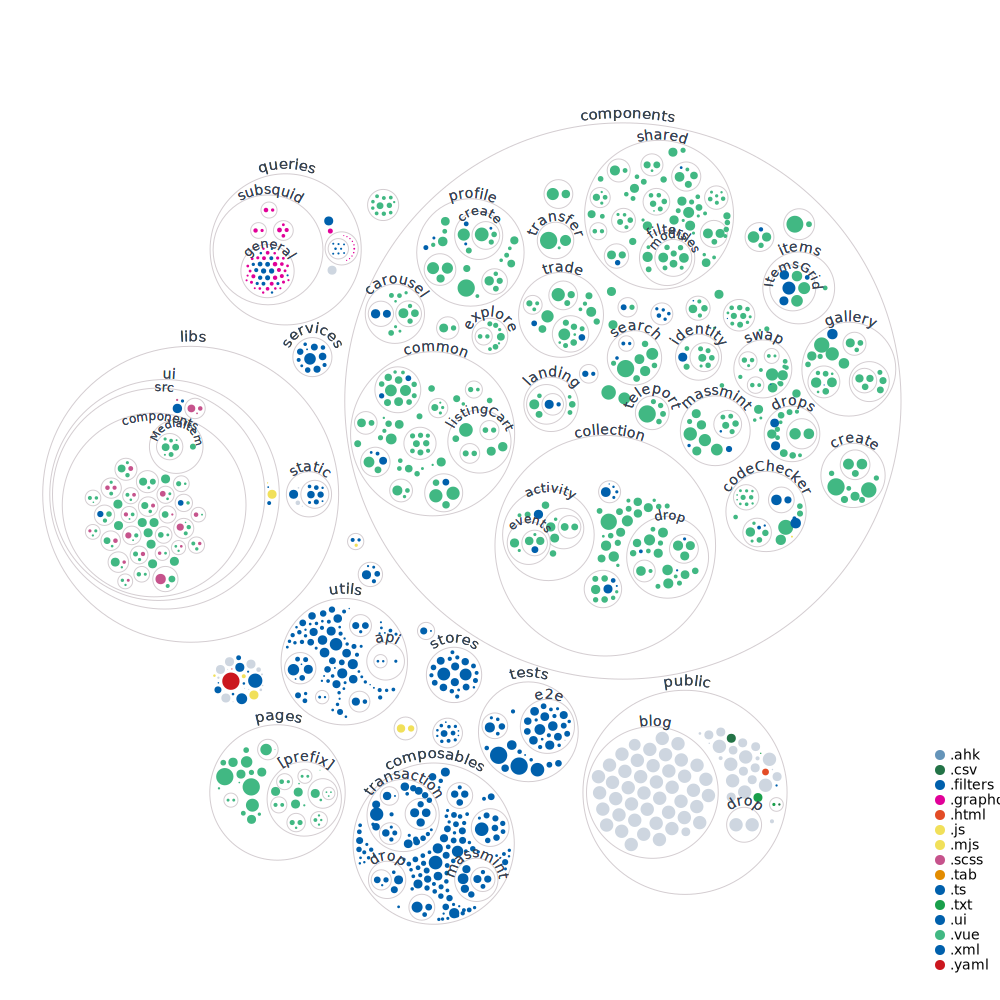

# NFT Explorer for Kusama & Polkadot & Substrate ecosystem

- Opensea for Polkadot, NFT paraverse of parachains, builded as public good.
- [First Time here?](FIRST_TIME.md)

## Coordination for development

# Repository Statistics

### Contributors over time to KodaDot

### All Recent Contributors ✨

[Monthly contributors overview](https://github.com/kodadot/nft-gallery/pulse/monthly)
[Graph of Contributors](https://github.com/kodadot/nft-gallery/graphs/contributors)

Thank to [contributors-img](https://contrib.rocks).

### Brief code structure

[Interactive visualization](https://octo-repo-visualization.vercel.app/?repo=kodadot%2Fnft-gallery)

### Hard facts about KodaDot development

### Static code analysis

### Amount Rewards inside

<!-- ### Is it maintained? -- I guess if its not under 10d not worth showing off

 -->

## Culture-🧫 - where you can read our recent updates

- [Twitter](https://twitter.com/KodaDot)
- [Discord](https://discord.gg/u6ymnbz4PR)

### Discontinued for now (if you want help us manage these, shout out on Discord)

- [Telegram](https://t.me/kodadot)
- [r/KodaDot](https://www.reddit.com/r/KodaDot/)

## Backlog on progress

- We've [bi-weekly digest, what we call **Meta_Hours**](https://github.com/kodadot/nft-gallery/discussions/categories/meta-hours).
- You can [find most recent progress, roadmap, planned features, bug fixes, future ideations](https://github.com/kodadot/nft-gallery/discussions/categories/meta-hours).

## Writings-📚 by KodaDot team members

- [KodaDot 2.0 -- Beta](https://medium.com/kodadot/kodadot-2-0-beta-d136f6ff139)
- [We've organized first Dotsama meetup in Lisbon thanks to KodaDot](https://medium.com/kodadot/first-dotsama-meetup-in-lisbon-and-how-the-kodadot-team-helped-to-make-it-real-10b4ca63d0b5)
- [Mass Airdrop and what we've learned](https://medium.com/kodadot/mass-airdrop-and-what-weve-learned-d063efb7c088)
- [Introducing Series Insights](https://medium.com/kodadot/introducing-series-insights-dde52dbadf5d)
- [JPEG summer is over. It's over, right?](https://medium.com/kodadot/jpeg-summer-is-over-its-over-right-e893ca2eeaa9)
- [Hello Kusummer](https://medium.com/kodadot/hello-kusummer-kodadot-edition-faca87753418)
- [Client-first NFT gallery: Technical examination](https://medium.com/kodadot/client-first-nft-gallery-technical-examination-33db09dfdc97)
- [How to Embed your NFT on Kusama through KodaDot](https://medium.com/kodadot/how-to-embed-your-nft-on-kusama-through-kodadot-ee52c2384b0d)
- [Traverse to the prime show](https://medium.com/kodadot/traverse-to-the-prime-show-733d6046d3f5)
- [The First Multilingual NFT Gallery in Polkadot ecosystem running live on Kusama](https://medium.com/kodadot/the-first-multilingual-nft-gallery-in-polkadot-ecosystem-running-live-on-kusama-b8f7566770be)
- [Read our story, how we started.](https://medium.com/kodadot/kodadot-nft-explorer-f2c3a326a856)

## Working version ▶️

- [Explore and Mint NFTs](https://kodadot.xyz/)
- [Beta Channel](https://beta.kodadot.xyz/)

## Roadmap 🛣 🗺

- [Beta](https://github.com/orgs/kodadot/projects/1)
- [XR - KodaVerse](https://github.com/orgs/kodadot/projects/2/views/1)
- [Meta Mobile](https://github.com/orgs/kodadot/projects/3/views/1)

## Development 🏗

- [Contribution is welcome!](CONTRIBUTING.md) and well rewarded in $KSM!

- [How to setup environment for first time and how to run the project.](FIRST_TIME.md)

## I want to contribute- 🙋‍

Your **contribution** is more than welcome.
Please follow our [code of conduct](CODE_OF_CONDUCT.md) and **[contribution guidelines](CONTRIBUTING.md)**

## Support the project ⭐

If you feel awesome and want to support us in a small way, please consider starring and sharing the repo! This helps us getting known and grow the community. 🙏 We will really appreaciate that!

## Patronage 💸

We have list of frequent participants in our codebase.
**You can send them $KSM**, native currency we use to payout bounties for **Pull Requests and coordinating issues.**

### Heroes 🦸‍♂️🦸🦸‍♀️

- [RoiLeo](https://kodadot.xyz/transfer/?target=DVYy1qnocE8t6ZvUfPx3rEjG829khNRXx3YrCGVHHj19Lcb)
- [Yangwao](https://kodadot.xyz/transfer/?target=CuHWHNcBt3ASMVSJmcJyiBWGxxiWLyjYoYbGjfhL4ovoeSd)
- [Vikiival](https://kodadot.xyz/transfer/?target=Fksmad33PFxhrQXNYPPJozgWrv82zuFLvXK7Rh8m1xQhe98)
- [Prachi00](https://kodadot.xyz/transfer/?target=EzGc4s9PgCPx1YnF3fqzhLzVHpHMTL4LWPScwpDrR8JKgSU)
- [kkukelka](https://kodadot.xyz/transfer/?target=EqdyzrzVmeHwMdMwvPeCMnNdbuQDbD3YrjY93xq9Ln3jUGW)

### Want to join?

- Want to be on this list? Become frequent participant by contributing more, [come with us](https://open.spotify.com/track/5kTBiVnjq9xKmZL9dNs8zL?si=9fc60b8b87764969)!
- [You can learn about our Contributors base](https://github.com/kodadot/nft-gallery/graphs/contributors)
