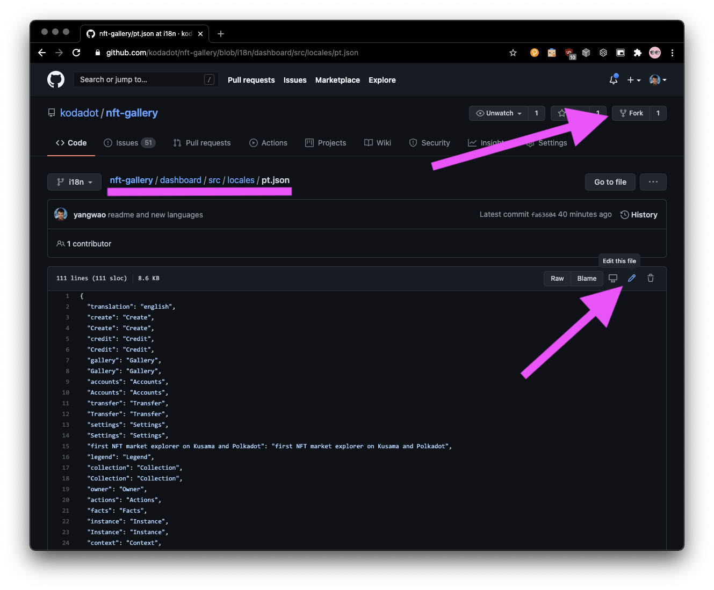

### From Terminal and see changes local

How to check your translations locally? 

You will need [nodejs enviroment](https://nodejs.org/en/download/) and [yarn](https://classic.yarnpkg.com/en/docs/install).

Particular commands you need to write to your terminal

1. Clone repository - `git clone https://github.com/kodadot/nft-gallery`
2. Checkout on `i18n` branch - `git checkout i18n`
3. Install dependencies packages `yarn`
4. Run local server `yarn serve`
5. Open browser on [http://localhost:9090](http://localhost:9090) 
6. If it is everything runs, that great!
7. Now open in your editor your language .json file which is in `dashboard/src/locales/`, for Spanish i.e. `dashboard/src/locales/es.json`
8. Everytime you hit save, reload page to see your changes live.
9. On the upper right you will see your flag. If you don't see your native language flag, [request us on translators channel](https://t.me/kodadot_translators) , we can add your language!
10. Once you are done, [make pull-request](https://docs.github.com/en/github/collaborating-with-issues-and-pull-requests/creating-a-pull-request)

### Translate from Browser
1. Fork the repository 
2. Go to same path in your repository
3. Choose language and hit edit

4. Make changes
5. Commit
6. Create pull request to our repository

We welcome your contribution and you will be historical part of KodaDot NFT contribution! :)
